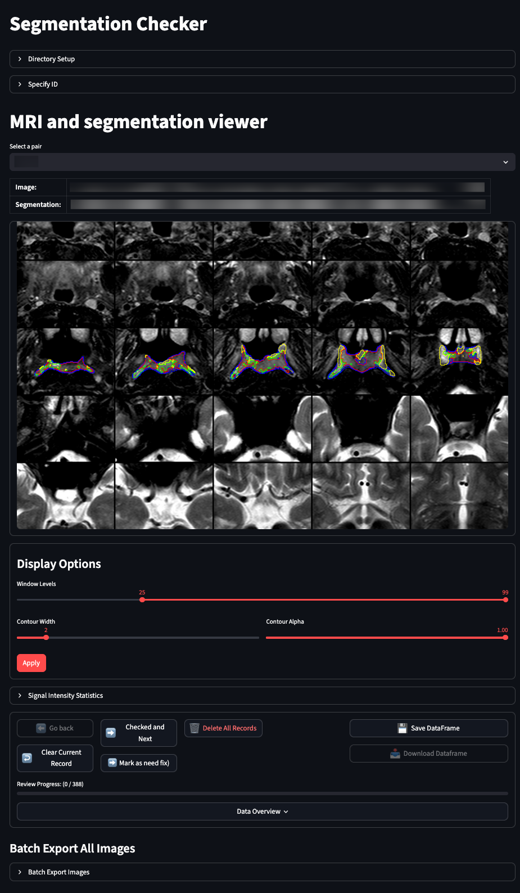
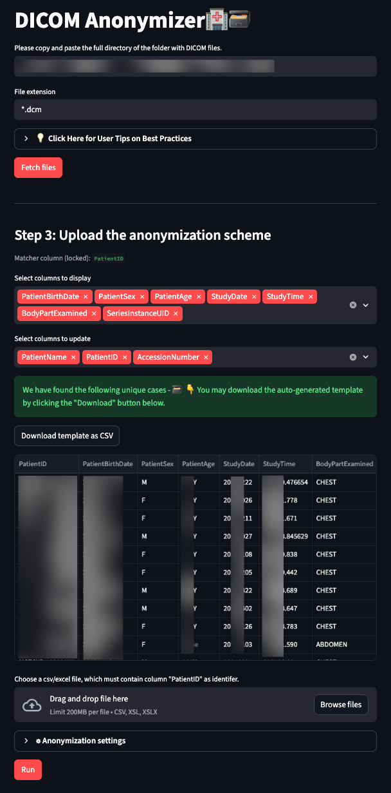

# Streamlit Medical Image Tools 

This is a collection of `streamlit` projects that were written for medical imaging processing by me. 

---

## Segmentation Check

This project aims to help you quickly review the segmentation in nifti format. It features a viewer that shows the image at a designated window level and overlay it with the contour of the segmentation. I wrote this because I found it extremely tideous to load images -> load segmentation using other software. I also find that when the software draws a mask instead of a contour, it obstructs the view of the underlying anatomy. 

### Features

* Load nifti images and segmentation
* Overlay images with contour of the segmentation
* Calculate and display volumes of each class of segmentation
* Configurable contour drawings
* Batch save the images with multi-thread processes

### Demo

---

## DICOM Anonymizer

A Streamlit application for anonymizing DICOM medical image files with an interactive web interface. This software was written for MRI, it's use on other imaging modalities are not well tested.

### Features

* Multi-threaded recrusive read of DICOM directories
* Sort DICOM directories based on a primary key (PK), e.g., patient IDs, patient name
* Anonymize or replace tag values with desired values by tag
* Anonymize or replace tag values by tag types
* Keep specific tags

### Demo

